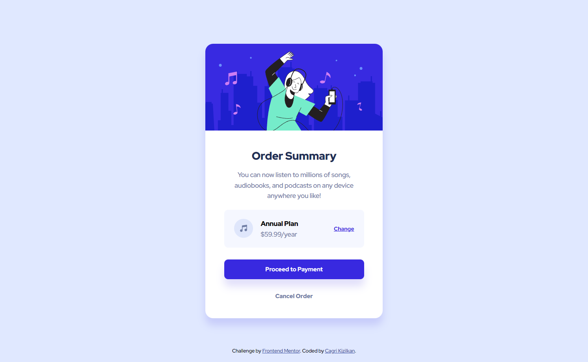

# Frontend Mentor - Order summary card solution

This is a solution to the [Order summary card challenge on Frontend Mentor](https://www.frontendmentor.io/challenges/order-summary-component-QlPmajDUj). Frontend Mentor challenges help you improve your coding skills by building realistic projects.

## Table of contents

- [Overview](#overview)
  - [The challenge](#the-challenge)
  - [Screenshot](#screenshot)
  - [Links](#links)
- [My process](#my-process)
  - [Built with](#built-with)
  - [Useful resources](#useful-resources)
- [Author](#author)

## Overview

### The challenge

Users should be able to:

- See hover states for interactive elements

### Screenshot

### Links

- Solution URL: [Frontend Mentor]()
- Live Site URL: [Order Summary Component]()

## My process

### Built with

- Semantic HTML5 Markup
- CSS Flexbox
- CSS Custom Properties
- Mobile-First Workflow

### Useful resources

- These Chrome Extensions helped me to make the project similiar to the design:

- [PerfectPixel](https://chrome.google.com/webstore/detail/perfectpixel-by-welldonec/dkaagdgjmgdmbnecmcefdhjekcoceebi)

- [Page Ruler](https://chrome.google.com/webstore/detail/page-ruler/jcbmcnpepaddcedmjdcmhbekjhbfnlff/)

## Author

- Website - [Cagri Kizilkan](https://cagrikizilkan.com)
- Frontend Mentor - [@cgrkzlkn](https://www.frontendmentor.io/profile/cgrkzlkn)
- Twitter - [@cgrkzlkn](https://www.twitter.com/cgrkzlkn)
